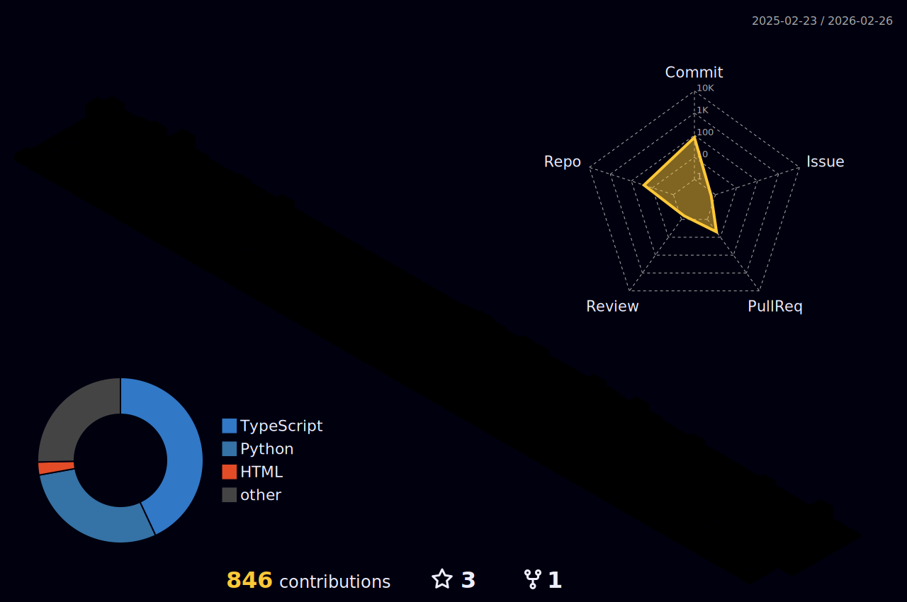

# 💫 About Me:
Aspiring AI automation engineer and founder of ASTITWA AI, building workflow automation, AI agents, and API‑driven systems for businesses. 🚀  Currently pursuing B.Tech CSE at MIT ADT University, with a strong focus on n8n-based automations, real-world deployment, and scalable, reliable solutions. 🎓  Passionate about using generative AI and networking fundamentals to turn complex business operations into simple, impact-driven workflows. 🤖 

## 🌐 Socials:
  

# 💻 Tech Stack:
                                                   
# 📊 GitHub Stats:
 
 

## 3D Contribution Calendar
<!-- This section is auto-generated by the GitHub-Profile-3D-Contrib action -->

## 🏆 GitHub Trophies

### ✍️ Random Dev Quote

### 🔝 Top Contributed Repo

---

  ## 💰 You can help me by Donating
  

<!-- Proudly created with GPRM ( https://gprm.itsvg.in ) -->
